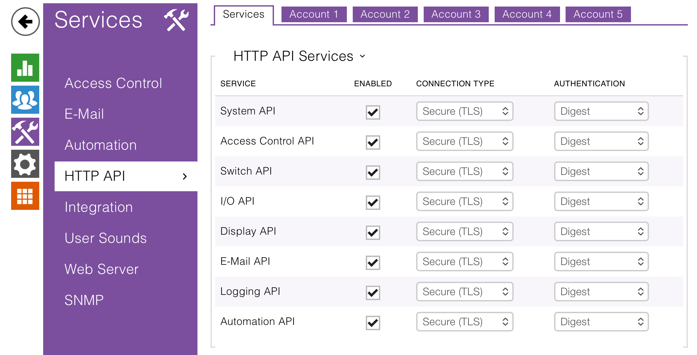
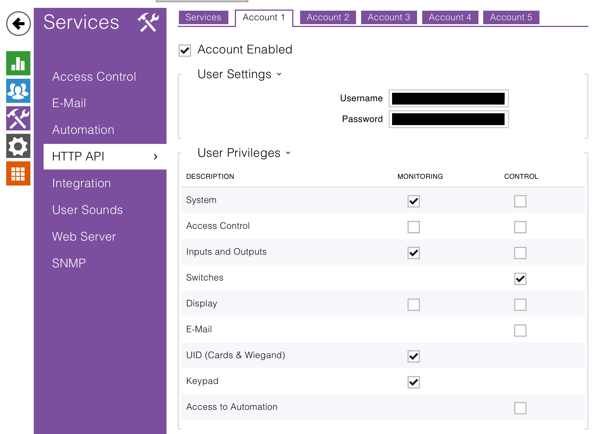

# 2n-hass
Home Assistant integration for 2N/Helios devices.

Based on the official [HTTP API](https://wiki.2n.com/hip/hapi/latest/en), but **this custom component is NOT associated to 2N in any way**. 2N, the 2N logo and the product names are registered trademarks by 2N and are solely used for identification purposes.

Forked from https://github.com/SVD-NL/helios2n-hass.

# Supported features
- Control and monitor switches (outputs), locks (bistable switches), and buttons (monostable)
- Sensors for attached inputs (dry contacts, door sensors, tamper)
- Real-time event entities:
  - Switch state changed (per switch, with originator & timestamp)
  - User authenticated (with user ID, name, method)
- Log subscription health monitoring (diagnostic binary sensor)
- Certificate fingerprint monitoring for HTTPS with self-signed certs
- Generic API action for advanced manual calls
- Device restart capability

*Note: Event support depends on device firmware capabilities.*

# Supported devices
All 2N IP intercoms and access units (IP Verso, LTE Verso, IP Style, etc., and 2N Access Unit 1.0/2.0/M).

**Minimum firmware: 2.35** (API is freely available from this version onward).
Older firmware may require a license for API access and are not officially supported.

*Always update your device to the latest firmware for best compatibility and security.*

# Installation
## HACS
1. Add https://github.com/Neffez/helios2n-hass as a custom repository
2. Download 2N/Helios through the regular explore & download prompt
3. Restart Homeassistant

## Manual
1. Copy custom_components/helios2n and its contents to the custom_components folder in your homeassistant configuration folder.
2. Restart HA.

# Configuration
## On device
1. Log in to the web interface of your intercom.
2. Go to system>maintenance and make sure your intercom is updated to the latest version. Creating a config backup is recommended.
3. Go to services>HTTP API and enable the following services. Decide whether to use unsecured/secured communication and which authentication method to use—see [API options](#api-options) below for details. *Can't find this menu item? Your device may not be supported*
	- System
	- Switch
	- I/O

  

4. Go to one of the "account" tabs at the top of the page
5. Create a username/password combo
6. Select the following permissions:
	- System - Monitoring
	- System - Control (if you need the restart function)
	- Switches - Control
	- Inputs and Outputs - Monitoring
	- Inputs and Outputs - Control (If you need to control the outputs directly)
	- UID (Cards & Wiegand) - Monitoring (e.g. for `UserAuthenticated` events)
	- Keypad - Monitoring (e.g. for `KeyPressed` or `CodeEntered` events)
	- **More permissions may be needed in the future**
  
  

### API options
The 2N/helios custom component supports all possible configuration options:

- Connection Type
  - HTTP
  - HTTPS with self-signed certificate -> disable SSL certificate verification
  - HTTPS with trusted certificate (e.g. Let's Encrypt or private PKI) -> enable SSL certificate verification
- Authentication
  - Basic Auth
  - Digest Auth

Be sure to set the same option in the 2N device and the custom component configuration.

According to the [official documentation](https://wiki.2n.com/hip/hapi/latest/en/3-zabezpeceni-sluzeb-http-api) the use of HTTPS and Digest Auth is recommended for best security.

Be aware that HTTPS ensures traffic is encrypted, even when using the default self-signed certificate. Especially when using Basic Auth this is highly recommended, otherwise credentials will be transmitted unencrypted.


## In Home Assistant
Go to Settings>Devices & Services>Add Integration. Search for 2N/Helios, and select it.
Enter the IP address or hostname of your device, and the API credentials you just made, for example:

host: "192.168.1.25"
username: "homeassistant"
password: "S3cUReP@sS"

*Note: username (and password, obviously) are case sensitive*

Your intercom is automatically added as a device. The integration creates:

- Entities for **all** switches (both enabled and disabled on the device). Disabled switches appear as disabled (greyed out) entities; you can manually enable them if needed.
- Event entities (switch state changed, user authenticated) **if** the device reports support via its API capabilities.

Monostable switches are added as button entities; bistable switches as lock entities.

After changing the switch configuration on the device (mode or enabled state), you must **reload** the integration (or restart HA) to update the entity set. Changing the switch mode will create a new entity and disable the previous one; reverting will re-enable the old entity and disable the new one.

Input binary sensors and output control switches are **disabled by default** (to avoid clutter). Other entities (locks, buttons, events) are enabled by default. Read-only status entities are optional and not created by default.

**Updating credentials**: If your device username/password change, you can update them without reconfiguring: go to Settings → Devices & Services → *Your Device* → *Configure*.

## A note about switches and outputs
Be careful when controlling the same output through a 2N switch and directly (via the output or relay entity) at the same time.
These can and will conflict with each other, and their statuses may desynchronise.
In those cases the state of the switch entity will be the accurate state of the output.
But again, this is highly discouraged.

## Synchronization Model
The integration uses two separate strategies to sync the device states to Home Assistant:

1. Active polling of the HTTP API endpoints

	Every 30 s the state of all entities is actively polled from the device. Additionally upon start of the integration or restart of Home Assistant.

2. Subscription to the device's event log

	Starting with version 0.5.0 entity states are also updated via the event log. The devices allow subscription to their event log which ensures that updates propagate almost immediately to Home Assistant (not limited by the polling interval). The integration triggers on corresponding log events and updates the entity states accordingly.

	A diagnostic binary sensor indicates if the subscription to the event log is healthy or not.

## Events

The integration subscribes to the device's event log and replicates the events onto Home Assistant's event bus. Subscribe to `helios2n_event` to see which events are fired. Each event payload contains the original log event from the API.

For examples see [docs/events.md](docs/events.md).

## Actions

For general information about calling actions in Home Assistant, see the [official documentation](https://www.home-assistant.io/docs/scripts/).

### `helios2n.api_call`

Directly call any 2N HTTP API endpoint via a Home Assistant Action. This is an advanced feature. Ensure the correct permissions are set for the API user.

**Action data:**

| Field | Type | Required | Description |
|-------|------|----------|-------------|
| `entry` | string | No (defaults to first) | Config entry ID/device to target |
| `endpoint` | string | Yes | API endpoint in `service/function` or `/api/service/function` format |
| `method` | string | No (default `GET`) | `GET`, `POST`, `PUT`, `DELETE` |
| `timeout` | integer | No (default 10) | Timeout in seconds (0–3600) |
| `data` | any | No | Form data for `application/x-www-form-urlencoded` |
| `json` | any | No | JSON payload (mutually exclusive with `data`) |
| `return_response` | boolean | No (default false) | If true, action returns the full JSON response |

**Example:** Get system info
```yaml
action: helios2n.api_call
data:
  endpoint: system/info
  method: GET
  return_response: true
```

**Example:** Restart device
```yaml
action: helios2n.api_call
data:
  endpoint: system/restart
  method: POST
```

## Troubleshooting

If event-driven automations are not triggering, check the health of the log subscription:

- Find the binary sensor `{device_name} log subscription healthy`.
- If it shows *off*, the log polling task has failed. Check Home Assistant logs for messages containing `helios2n`.
- A temporary loss of connectivity may cause the watchdog to restart the subscription automatically within seconds.

## Bug reports and feature requests
When filing a bug report or requesting a feature, please open an issue and use the provided templates.

### Debug Logging
In case of any issues enable debug logging in `configuration.yaml`:
```
logger:
  default: info
  logs:
    custom_components.helios2n: debug
    py2n: debug
```
